# <center>计算机系统综合设计实验报告</center>

感谢澳哥帮助😋🧡

`Ubuntu`版本：18.04(老师发的指导书上说用`Ubuntu20.04`出现了问题)

| 班级     | 姓名   | 学号       |
| -------- | ------ | ---------- |
| 计算机91 | 刘青帅 | 2191211634 |

说明：如果按照下面的一步一步来，应该不会出现问题(经王姐检验，是这样的)

<hr style="background-color:red; height:5px">

我新建了一个`Desktop`文件夹，Desktop和桌面是两个独立的文件夹，你如果看到目录有<font color=red>桌面</font>这样的字眼，这是我之前做的，截图忘改了。(这里建议用英文路径，用中文的**桌面**其实也没问题，就是后面修改一个路径的时候`configmenu`无法输入中文，需要`vim`输入中文)


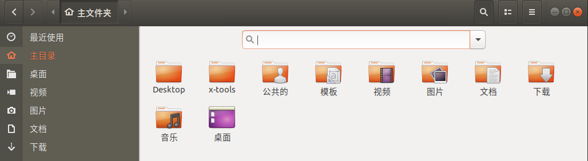

`Desktop`目录下新建`cross`文件夹和`arm`文件夹

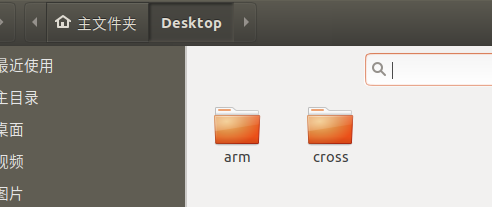

`cross`的目录如下（先看一下就行，防止后面乱，你可以回看一下）

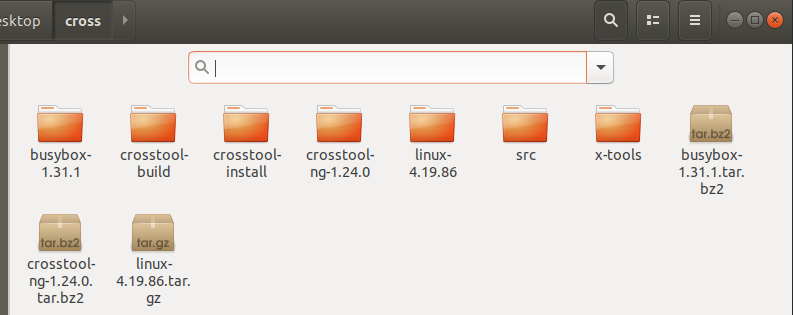

<hr style="background-color:red; height:5px">

## 一、 面向飞腾处理器编译Linux内核和基本工具

提前安装下面东西，防止出错

```
sudo apt-get install make qemu-system-arm gcc-arm-linux-gnueabi libncurses5-dev bison flex vim gcc g++ build-essential
```

### 1.1实验目的

利用`QEMU`创建飞腾（`ARM`） 架构计算机，在此之上编译一个基本的`Linux`操作系统

### 1.2实验步骤

先下载好`busybox`和`linux`内核的源码，并解压

下载`busybox`

```
wget https://busybox.net/downloads/busybox-1.31.1.tar.bz2
```

谷歌搜索`linux-4.19.86`自己下载

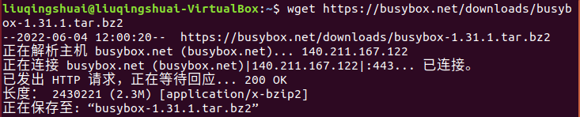

下载并解压好之后(右键压缩的文件，手动提取到当前目录就行)

<div align="center">
    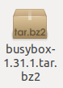
    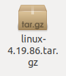
</div>
`cd`到解压后的`busybox`的目录里面，执行下面三个指令，

<font color=red>其中第一个出现menu只需要退出就行，里面已经勾选了默认的参数  </font>

上面是指导书上的说的，不要这样干，千万不要直接退出，要把下面的**Build static binary**勾选上！！！

```
make ARCH=arm CROSS_COMPILE=arm-linux-gnueabi- menuconfig
	一定注意把这个选上  选中Settings->Build static binary(no shared libs) (NEW) 往下滑滑滑
make ARCH=arm CROSS_COMPILE=arm-linux-gnueabi-
make ARCH=arm CROSS_COMPILE=arm-linux-gnueabi- install
```

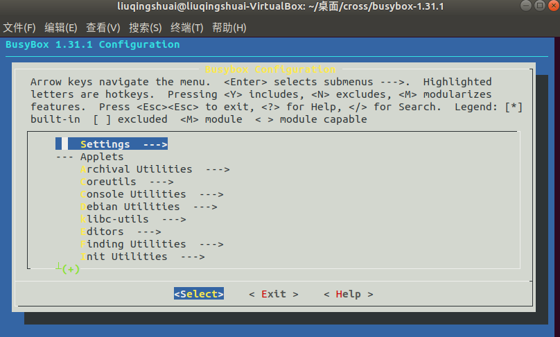


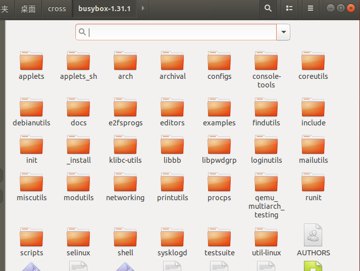

上面3个make指令完毕后，在`_install`目录下生成一些文件,创建下列文件夹备用： etc proc sys tmp dev lib  

```
mkdir etc proc sys tmp dev lib
```

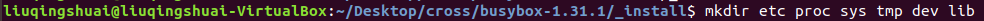

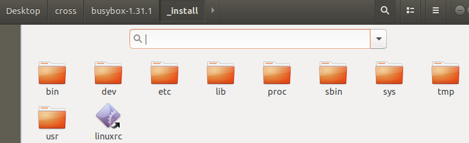

`dev`目录下静态创建如下节点：  

```
sudo mknod -m 666 tty1 c 4 1
sudo mknod -m 666 tty2 c 4 2
sudo mknod -m 666 tty3 c 4 3
sudo mknod -m 666 tty4 c 4 4
sudo mknod -m 666 console c 5 1
sudo mknod -m 666 null c 1 3
```

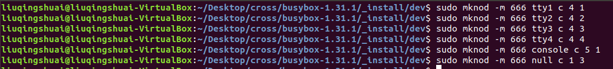

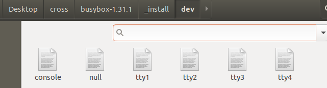

向`_install/etc`目录新建`inittab`文件、`fstab`文件(这是二进制文件，没有后缀)

```
touch inittab fstab
```

使用`vim`写入文件

`inittab`文件如下

```
::sysinit:/etc/init.d/rcS
::askfirst:/bin/sh
::ctrlaltdel:/sbin/reboot
::shutdown:/sbin/swapoff -a
::shutdown:/bin/umount -a -r
::restart:/sbin/init
tty2::askfirst:/bin/sh
tty3::askfirst:/bin/sh
tty4::askfirst:/bin/sh
```

`fstab`文件如下

```
#device mount-point type option dump fsck order
proc  /proc proc  defaults 0 0
temps /tmp  rpoc  defaults 0 0
none  /tmp  ramfs defaults 0 0
sysfs /sys  sysfs defaults 0 0
mdev  /dev  ramfs defaults 0 0
```

向`etc`目录新建`init.d文件夹`，在`init.d文件夹`下新建`rcS文件`

```
mkdir init.d
cd ./init.d
touch rcS
```

`rcS`文件如下

```
mount -a
echo "/sbin/mdev" > /proc/sys/kernel/hotplug
/sbin/mdev -s
mount -a
```

然后一定要修改`rcS`文件的权限

```
chmod +x rcS
```

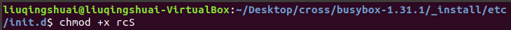

把依赖的库文件拷贝到`_install/lib/`目录下 (如下)

`busybox`目录下搜索`modules`文件夹，全局搜索下面文件，均拷贝到`_install/lib`目录下


结果如下

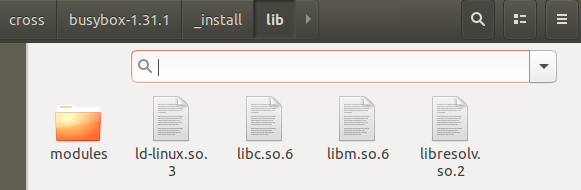

接下来编译`linux`内核（在解压的`linux`目录下`make`），第二步时间很长，你可以偷着乐

```
make ARCH=arm CROSS_COMPILE=arm-linux-gnueabi- vexpress_defconfig
make ARCH=arm CROSS_COMPILE=arm-linux-gnueabi-
```

此时`boot`目录如下

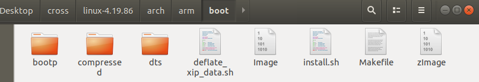

再进行如下步骤（在`linux`目录下make）

```
make ARCH=arm CROSS_COMPILE=arm-linux-gnueabi- modules_install INSTALL_MOD_PATH="/home/liuqingshuai/Desktop/cross/busybox-1.31.1/_install/"
```

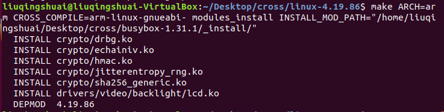

`Desktop`上创建一个`arm`文件夹，然后在`arm`目录下执行下面步骤

```
dd if=/dev/zero of=rootfs.ext3 bs=1M count=32
mkfs.ext3 rootfs.ext3
sudo mount -o loop rootfs.ext3 /tmp
sudo cp -a /home/liuqingshuai/Desktop/cross/busybox-1.31.1/_install/* /tmp
sudo umount /tmp
```

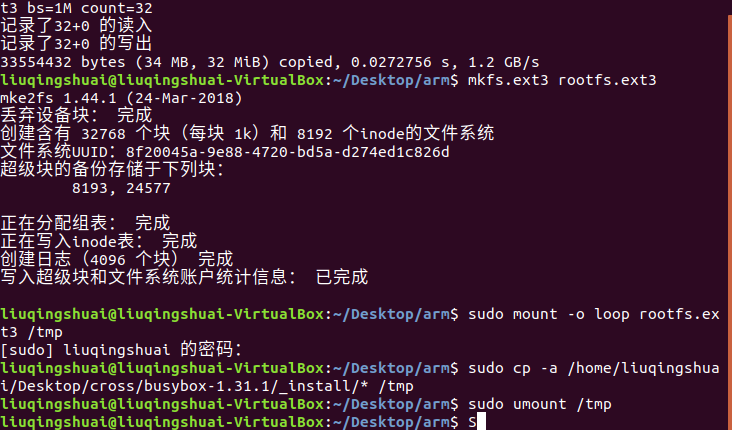

将`/home/liuqingshuai/Desktop/cross/linux-4.19.86/arch/arm/boot`的`zImage`拷贝到arm目录下

将`/home/liuqingshuai/Desktop/cross/linux-4.19.86/arch/arm/boot/dts`的`vexpress-v2p-ca9.dtb`拷贝到`arm`目录下

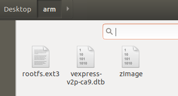

在`arm`下执行如下命令

```
qemu-system-arm -M vexpress-a9 -kernel ./zImage -nographic -m 512M -smp 4 -sd ./rootfs.ext3 -dtb vexpress-v2p-ca9.dtb -append "init=/linuxrc root=/dev/mmcblk0 rw rootwait earlyprintk console=ttyAMA0"
```

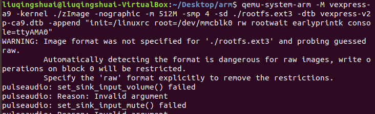

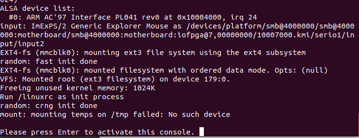

用几个命令测试一下

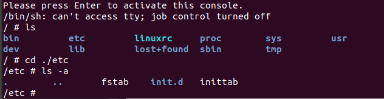

至此，实验完了

### 1.3实验结果

本次实验利用`qemu`创建飞腾架构计算机，在此之上编译一个基本的`Linux`操作系统，通过`Busybox`构建了基本的系统命令。  

## 二、面向飞腾处理器的交叉编译环境

提前安装，防止出错

```
sudo apt-get install autoconf automake libtool libncurses5-dev gperf texinfo help2man gawk libtool-bin
```

### 2.1实验目的

利用`crosstool`制作一个交叉编译工具链，使其能交叉编译c源文件， 生成飞腾平台下的可执行文件

### 2.2 实验步骤

下载`crosstool`压缩包然后压缩包右键提取一下

```
wget http://crosstool-ng.org/download/crosstool-ng/crosstool-ng-1.24.0.tar.bz2
```


和`crosstool-ng-1.24.0`并列关系创建`crosstool-build`，`crosstool-install`，`src`、`x-tools`文件夹


```
mkdir crosstool-build crosstool-install src x-tools
```

在`crosstool-ng-1.24.0`目录下依次执行

```
./bootstrap
./configure --prefix /home/liuqingshuai/Desktop/cross/crosstool-install
make
sudo make install
```

进入`crosstool-install/bin`目录下执行

```
./ct-ng
./ct-ng -v
```

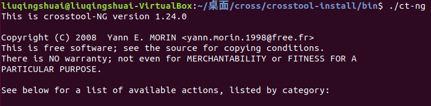

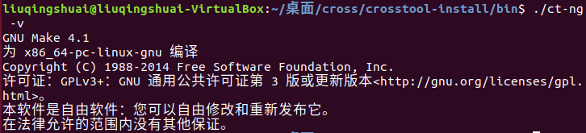

`crosstool-install/bin`目录下可以看到如下文件

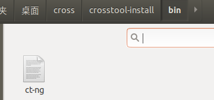

然后添加临时的环境变量（添加一下`ct-ng`的文件夹路径到`PATH`中，方便之后调用）

`export PATH=$PATH:/home/liuqingshuai/Desktop/cross/crosstool-install/bin/`

下面是网上说的`export`作用

<hr style="background-color:red; height:5px">

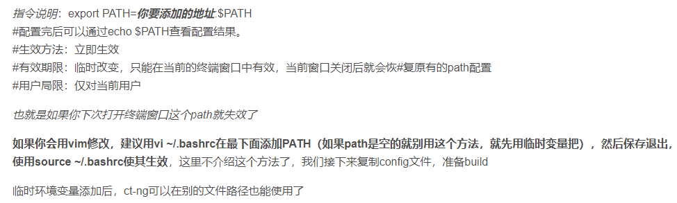

<hr style="background-color:red; height:5px">


`src`文件夹有如下压缩包（谷歌搜一下，下载），左侧截图多了几个不需要的，以右侧为准（当然，多下载肯定不会出错）

<div>
  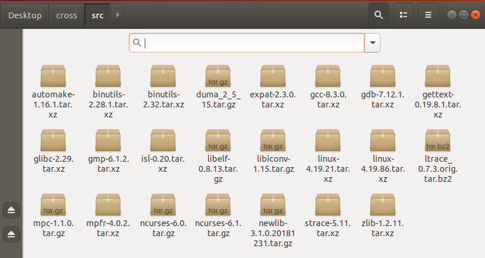
  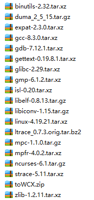
</div>

在`crosstool-build`目录下执行

```
ct-ng menuconfig
```

然后做下述修改

选择`Paths and misc options`，找到`Working directory`和`Local tarballs directory`修改

还可以设置一下`Number of parallel jobs`(并行任务的数量，非必要)

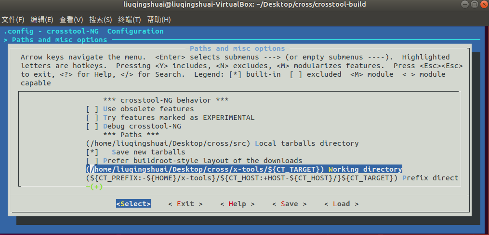

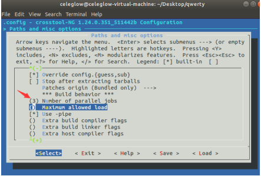

选择`Target options`，架构选`arm`，`Architecture level`填写为`armv7-a`，（你的界面应该有一个**ev4**，把这个去掉才能出现`architecture level`）

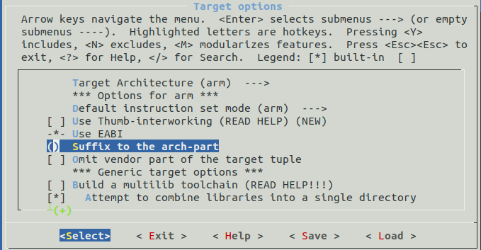

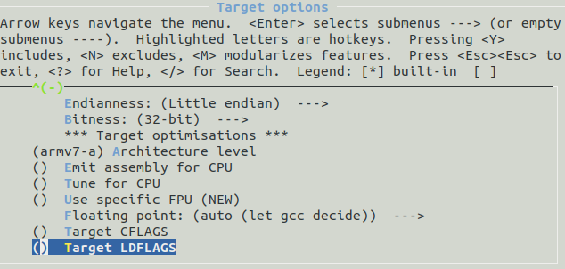

选择`Operating System`，`Target OS`改为`linux`，后面的版本号不用管，之后会手动修改

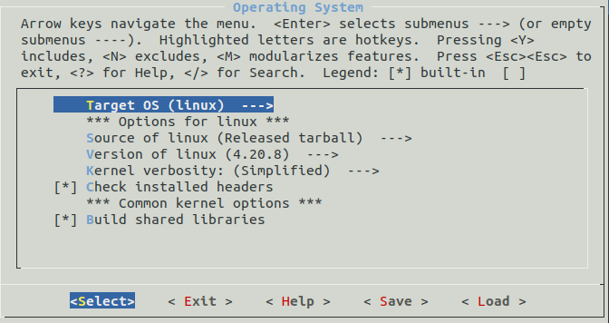

编辑`.config`(在`crosstool-build`目录下,`.config`文件通过`ls`看不到，需要`ls -a`)(上一步`ct-ng menuconfig`之后会自动生成`.config`文件)

```
vim .config
```

修改`CT_GLIBC_MIN_KERNEL`为`4.19.86`

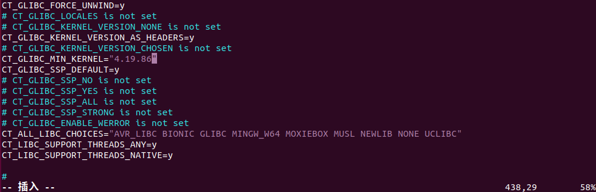

`CT_LINUX_VERSION`为`4.19.86`

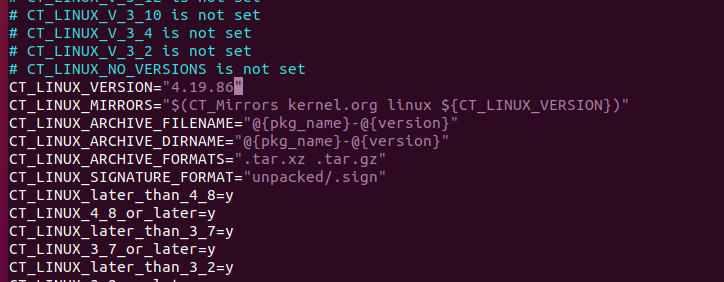

在`crosstool-build`下执行下面指令（时间很长）

```
ct-ng build
```

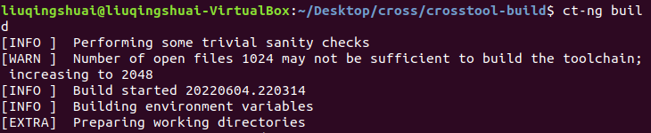

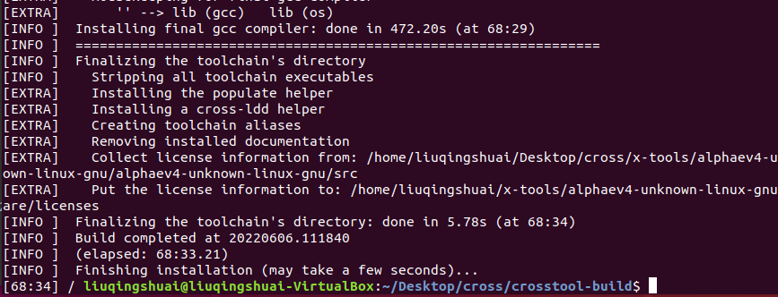

生成的`gcc`在如下目录`/home/liuqingshuai/Desktop/cross/x-tools/arm-unknown-linux-gnueabi/arm-unknown-linux-gnueabi/buildtools/bin`

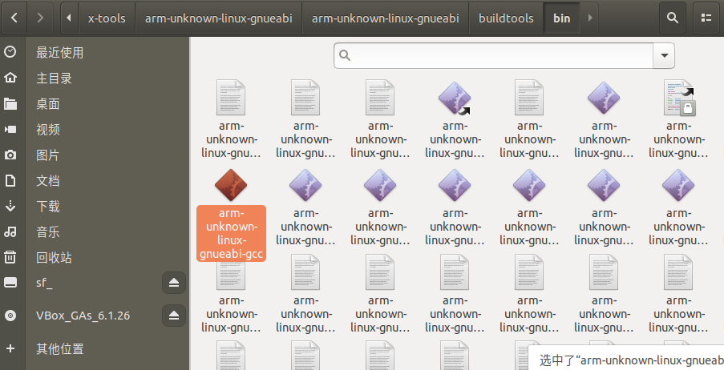

测试一下这个`gcc`的版本(在上面那个`bin`目录下测试)

```
./arm-unknown-linux-gnueabi-gcc --version
```

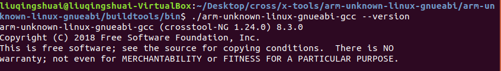

`gcc`的绝对位置如下`/home/liuqingshuai/Desktop/cross/x-tools/arm-unknown-linux-gnueabi/arm-unknown-linux-gnueabi/buildtools/bin/arm-unknown-linux-gnueabi-gcc`


`arm`目录新建一个`helloworld.c`然后编译

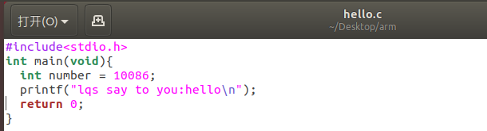

```
/home/liuqingshuai/Desktop/cross/x-tools/arm-unknown-linux-gnueabi/arm-unknown-linux-gnueabi/buildtools/bin/arm-unknown-linux-gnueabi-gcc -static hello.c -o hello
```

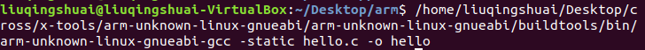


采用实验 1 的挂载

```
sudo mount -o loop ./rootfs.ext3 /tmp
```

然后把这个`world`可执行文件 copy 到`tmp`目录里，如果遇到权限不够的错误，则在`arm`目录下执行指令，然后再复制（会出现**读一行什么玩意的error**，不用管），权限就够了

```
sudo nautilus
```

然后取消挂载

```
sudo umount /tmp
```

`arm`目录下下启动`arm`模拟器

```
qemu-system-arm -M vexpress-a9 -kernel ./zImage -nographic -m 512M -smp 4 -sd ./rootfs.ext3 -dtb vexpress-v2p-ca9.dtb -append "init=/linuxrc root=/dev/mmcblk0 rw rootwait earlyprintk console=ttyAMA0"
```

然后运行可执行文件，成功输出

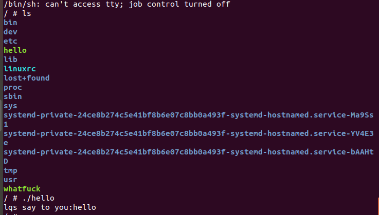

至此，实验完了

### 2.3实验结果

成功生成了 `arm` 的 `gcc` 编译工具，并成功生成 `arm` 平台下可执行文件，同时在 `qemu` 模拟器里成功执行

## 三、应用程序开发  

### 3.1实验目的

利用实验一编译出的操作系统和实验二构建的编译工具链，完成一个基于c语言的SHA-1应用程序开发。 编译产生的可执行文件能在 qemu 中执行。

### 3.2算法步骤

对于任意长度的明文，SHA1首先对其进行分组，使得每一组的长度为512位，然后对这些明文分组反复重复处理。

对于每个明文分组的摘要生成过程如下：

（1） 将512位的明文分组划分为16个子明文分组，每个子明文分组为32位。

（2） 申请5个32位的链接变量，记为A、B、C、D、E。

（3） 16份子明文分组扩展为80份。

（4） 80份子明文分组进行4轮运算。

（5） 链接变量与初始链接变量进行求和运算。

（6） 链接变量作为下一个明文分组的输入重复进行以上操作。

（7） 最后，5个链接变量里面的数据就是SHA1摘要。

:file_cabinet: sha1.c

```c
#include <stdio.h>
#include <stdlib.h>
#define SHA1_ROTL(a,b) (SHA1_tmp=(a),((SHA1_tmp>>(32-b))&(0x7fffffff>>(31-b)))|(SHA1_tmp<<b))
#define SHA1_F(B,C,D,t) ((t<40)?((t<20)?((B&C)|((~B)&D)):(B^C^D)):((t<60)?((B&C)|(B&D)|(C&D)):(B^C^D)))
long SHA1_tmp;
char* StrSHA1(const char* str, long long length, char* sha1){
    /*
    计算字符串SHA-1
    参数说明：
    str         字符串指针
    length      字符串长度
    sha1         用于保存SHA-1的字符串指针
    返回值为参数sha1
    */
    char *pp, *ppend;
    long l, i, K[80], W[80], TEMP, A, B, C, D, E, H0, H1, H2, H3, H4;//K和W是32位的数组
    H0 = 0x67452301, H1 = 0xEFCDAB89, H2 = 0x98BADCFE, H3 = 0x10325476, H4 = 0xC3D2E1F0;//初始化变量
    for (i = 0; i < 20; K[i++] = 0x5A827999);
    for (i = 20; i < 40; K[i++] = 0x6ED9EBA1);
    for (i = 40; i < 60; K[i++] = 0x8F1BBCDC);
    for (i = 60; i < 80; K[i++] = 0xCA62C1D6);
    l = length + ((length % 64 > 56) ? (128 - length % 64) : (64 - length % 64));//l=64
    printf("l=%d\n",l);
    if (!(pp = (char*)malloc((unsigned long)l))) return 0;
    for (i = 0; i < length; pp[i + 3 - 2 * (i % 4)] = str[i], i++);//为llehw ,odlro
    for (pp[i + 3 - 2 * (i % 4)] = 128,i++; i < l; pp[i + 3 - 2 * (i % 4)] = 0,i++);
    *((long*)(pp + l - 4)) = length << 3;
    *((long*)(pp + l - 8)) = length >> 29;
    for (ppend = pp + l; pp < ppend; pp += 64){
        for (i = 0; i < 16; W[i] = ((long*)pp)[i], i++);
        for (i = 16; i < 80; W[i] = SHA1_ROTL((W[i - 3] ^ W[i - 8] ^ W[i - 14] ^ W[i - 16]), 1), i++);
        A = H0, B = H1, C = H2, D = H3, E = H4;
        for (i = 0; i < 80; i++){
            TEMP = SHA1_ROTL(A, 5) + SHA1_F(B, C, D, i) + E + W[i] + K[i];
            E = D, D = C, C = SHA1_ROTL(B, 30), B = A, A = TEMP;
        }
        H0 += A, H1 += B, H2 += C, H3 += D, H4 += E;
    }
    free(pp - l);
    sprintf(sha1, "%08X%08X%08X%08X%08X", H0, H1, H2, H3, H4); 
    return sha1;
}

int main(){
  printf("你好\n");
  char sha1[41]={0}; //sha1用于保存计算结果
  StrSHA1("hello, world", 12, sha1); //计算字符串“hello, world”前12位的sha1
  printf(sha1);
  printf("\n");
}
```

终端执行

```
/home/liuqingshuai/Desktop/cross/x-tools/arm-unknown-linux-gnueabi/arm-unknown-linux-gnueabi/buildtools/bin/arm-unknown-linux-gnueabi-gcc -static sha1.c -o sha1Arm
sudo mount -o loop ./rootfs.ext3 /tmp
sudo nautilus
拷贝sha1Arm到tmp目录
sudo umount /tmp
qemu-system-arm -M vexpress-a9 -kernel ./zImage -nographic -m 512M -smp 4 -sd ./rootfs.ext3 -dtb vexpress-v2p-ca9.dtb -append "init=/linuxrc root=/dev/mmcblk0 rw rootwait earlyprintk console=ttyAMA0"
```

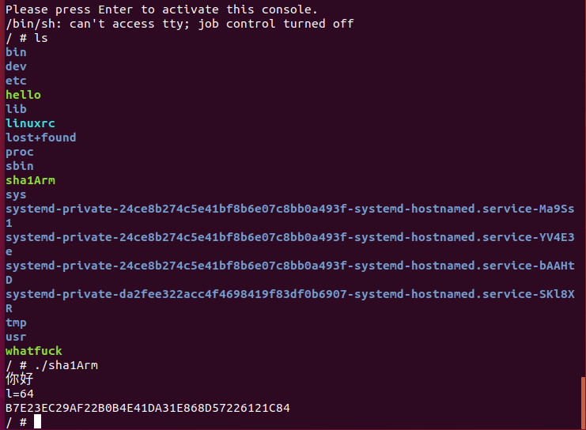

在网站上验证`hello, world`(中间有一个空格)的sha1加密结果，发现完全一样。

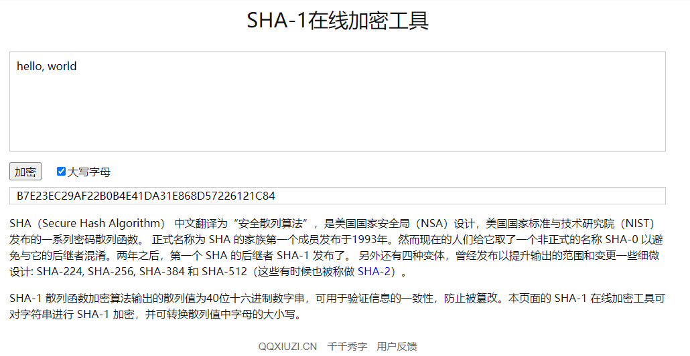

### 3.3实验结果

成功写了一个能计算`SHA-1`的C语言程序，并利用自己的交叉编译工具链生成了可执行文件，在`qemu`模拟器里成功执行


如果您觉得我写的不错，给您节省了时间，谢谢就不用了，可以给咱money支持😍

<div align=center>
  
  
</div>


